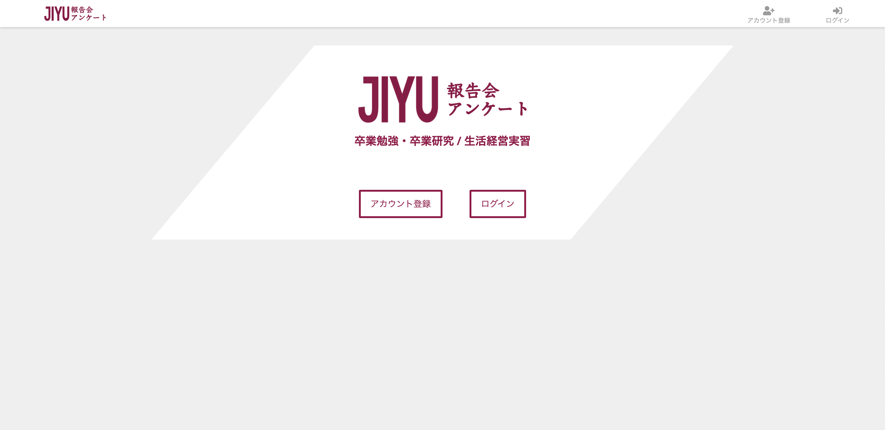
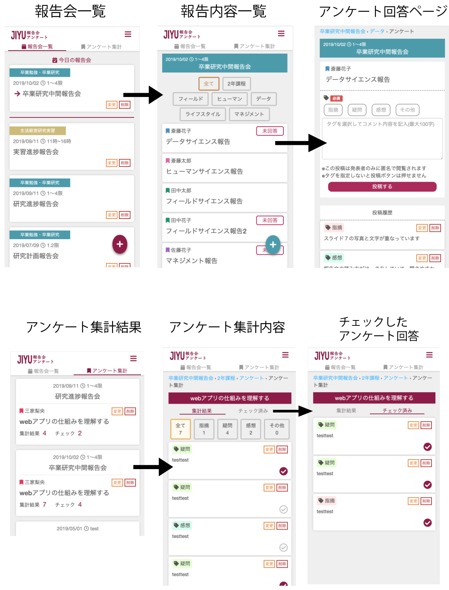

# 自由学園報告会アンケートについて

## アプリ説明

自由学園生徒が行う研究報告会の報告アンケートをwebアプリ化したものです。 
web上でアンケートフォームを作成し、自動集計することができます。 
今まで紙媒体で行なっていたアンケートをアプリ化することで、アンケートの回答をデータとして管理しやすくしました。 

## 使用言語・技術  

Ruby:2.6.2 / Ruby on Rails:5.0.6 / bootstrap / html / css / git / illustrator  

##  アプリを作った目的
アンケートを実施する側、回答する側を経験して感じていた不便さ・問題点を改善するために作りました。 
  
<実施側での不便な点、問題点>  
・アンケートを作成、集計する係の負担が大きい 
・紙媒体のため管理、保管が面倒くさい 
・アンケート回答の字が読めない時がある 

<回答側での不便な点、問題点>  
・紙が大きく、机がないので記入しずらい 
・アンケートに書く内容が思いつかない  

これらの問題点を踏まえて、このアプリでは以下の機能を提供することを目標にしています。 
・アンケートの作成、集計の手間をなくす  
・報告会アンケートをデータとして保存、保管する  
・記入者がよりアンケートを回答しやすい環境 

## 実装機能
・Digest認証機能 
・ログイン機能（Cookieとsessionによるログイン） 
・アンケート作成機能 
・アンケート回答機能 
・アンケート回答自動集計機能 
・タグ付け機能（指摘・疑問・感想・その他のタグをつけてアンケートを回答する） 
・チェック保存機能（中間テーブルの作成、紐付け） 
・チェック保存の非同期化 
・ユーザー権限（アンケート作成者、アンケート回答者、教師それぞれに権限を設定） 
・アニメーション（Animate.css（CDN）の使用） 

## アピールポイント
・紙媒体で行なっていたアンケートの内容をそのままwebアプリ化できた 
・アカウント登録時にDigest認証を行い、関係者以外のアカウント作成を防ぐ 
・タグ付け機能により、アンケート集計を回答の種類ごとに分けて見ることができる 
・チェック保存機能により重要な回答を区別することが可能 
・今日開催される報告会を報告会一覧の一番上に表示する 

##

